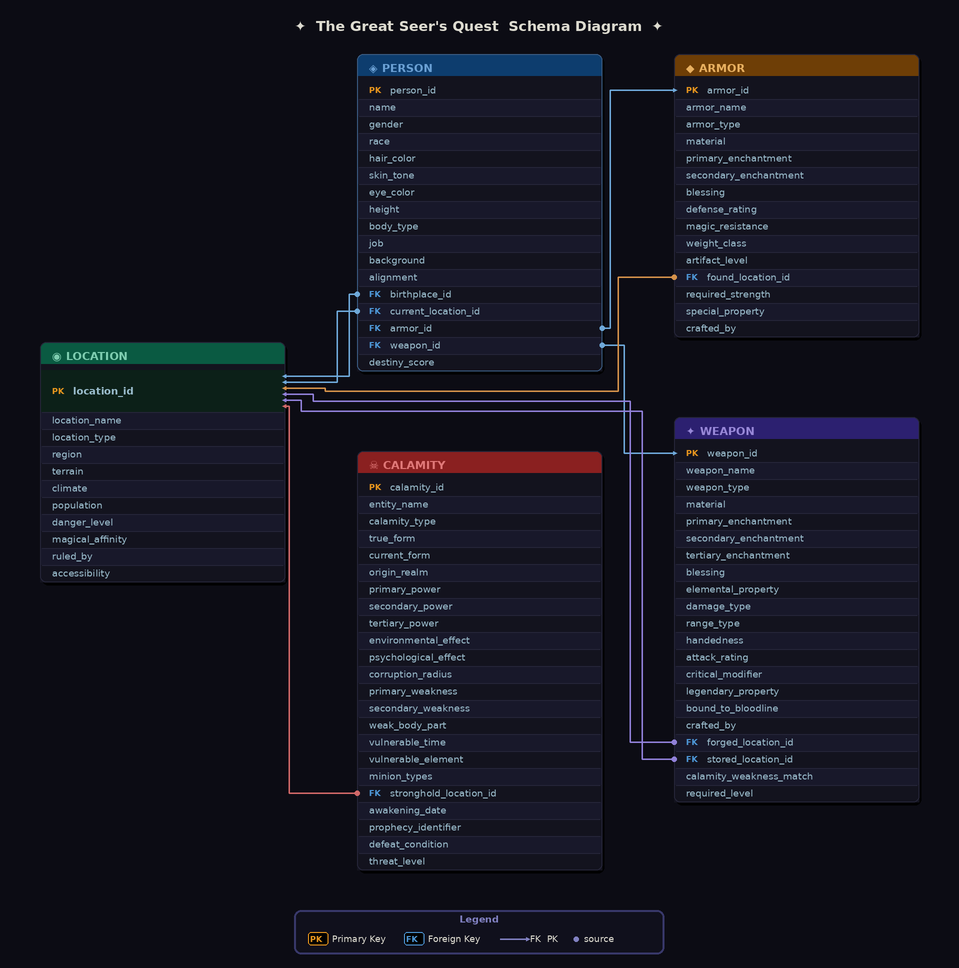

# The Great Seer's Quest

A browser-based SQL learning game where players use real SQL queries against an in-memory database to uncover a hero, armor, weapon, and calamity across four progressively harder chapters.



---

## About the Project

The Great Seer's Quest is a fully client-side SQL puzzle game. No server, no login, no backend. The database is generated fresh in the browser every run using [sql.js](https://sql.js.org/).

Players write real SQL queries against live in-memory tables and receive immediate feedback. Difficulty scales progressively across four chapters, from simple WHERE filters up to multi-table JOINs with five or more filter conditions.

---

## Features

- Four chapters of escalating SQL difficulty (Novice through Expert)
- Procedurally generated quest data every run -- no two games are the same!!
- Full-width dataset browser at the bottom with Ctrl+F-style highlight search and prev/next navigation
- Five different story endings based on your Seer Rating (hints used, reveals used)
- Difficulty selector: Novice, Apprentice, Adept, Expert

---

## Tools & Technologies

- **sql.js** -- SQLite compiled to WebAssembly, runs entirely in browser
- **Vanilla JS / HTML / CSS** -- no framework dependencies
- **Google Fonts / CDN** -- no npm install needed

---

## Architecture

```
seer_sql/
├── index.html                   # Main game UI and styles
├── schema_diagram.png           # ER diagram shown in tutorial
├── js/
│   ├── app.js                   # Game logic, query engine, UI state
│   ├── client_side_generator.js # Procedural quest + data generation
│   └── database.js              # (Reserved for future db helpers)
└── data/
    ├── schema.sql               # Table definitions (person, armor, weapon, calamity, location)
    └── locations.sql            # Static location seed data
```

### Data Flow

```
schema.sql + locations.sql
        │
        ▼
  sql.js (WASM SQLite)
  window.db [in-memory]
        │
        ▼
  QuestGenerator
  (procedural hero / armor / weapon / calamity + 100+ decoys)
        │
        ▼
  Player writes SQL queries
        │
        ▼
  checkAnswer() validates result
        │
        ▼
  Chapter transitions → Seer Rating → Ending
```

---

## Database Schema

| Table      | Key Columns |
|------------|-------------|
| `person`   | person_id, name, race, job, alignment, hair_color, skin_tone, eye_color, height, body_type, background, gender, current_location_id, destiny_score |
| `armor`    | armor_id, armor_name, armor_type, material, blessing, weight_class, defense_rating, magic_resistance, artifact_level, primary_enchantment, found_location_id |
| `weapon`   | weapon_id, weapon_name, weapon_type, material, elemental_property, handedness, damage_type, attack_rating, artifact_level, blessing, calamity_weakness_match, stored_location_id |
| `calamity` | calamity_id, entity_name, calamity_type, true_form, origin_realm, primary_power, vulnerable_element, weak_body_part, environmental_effect, defeat_condition, stronghold_location_id |
| `location` | location_id, location_name, region, danger_level |

---

## Seer Rating

| Rating | Condition |
|--------|-----------|
| The All-Seeing Seer | 0 hints, 0 reveals |
| Master Seer | 1 hint, 0 reveals |
| Seer | 2 hints, 0 reveals |
| Apprentice Seer | 3-4 hints, 0 reveals |
| Blinded Seer | Any reveal used |

Each tier has a unique ending story. So try your best Seers!

---

## Next Steps

- Add more clue variety and difficulty tiers
- Leaderboard using GitHub Issues or a lightweight backend
- Localization support
- Mobile layout improvements
- Export completed query history as a learning summary